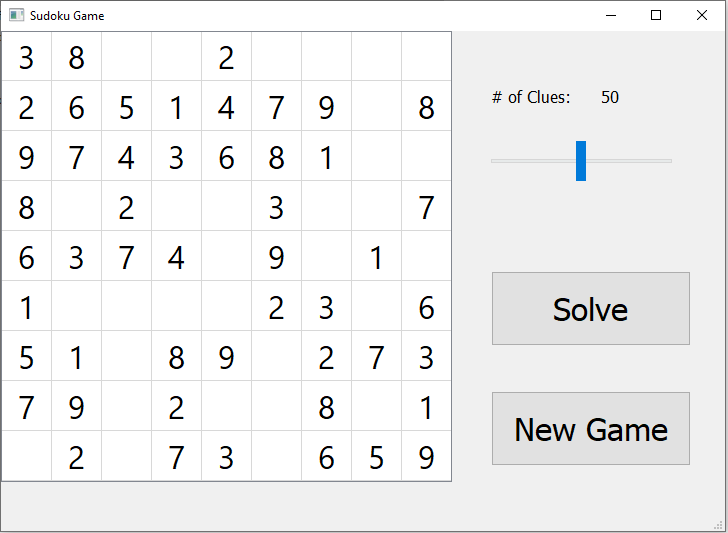

# Sudoku_Game

Sudoku game made by pyqt module

Features:
1. Different level of difficulties can be selected by increasing or decreasing # of clues given

TODO:
1. Timer
2. High score tracker
3. Differnet font to differentiate user_input from clues 
4. Message when giving wrong answer
